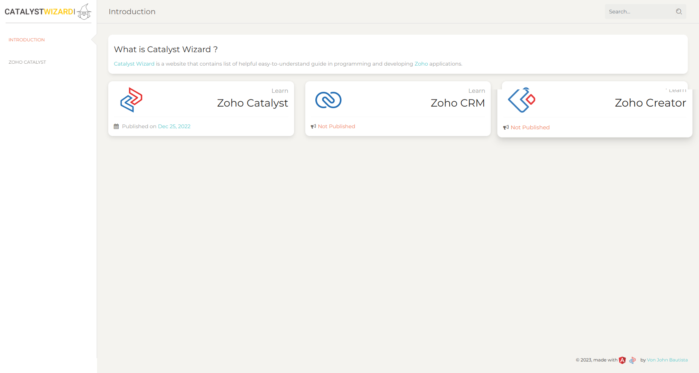
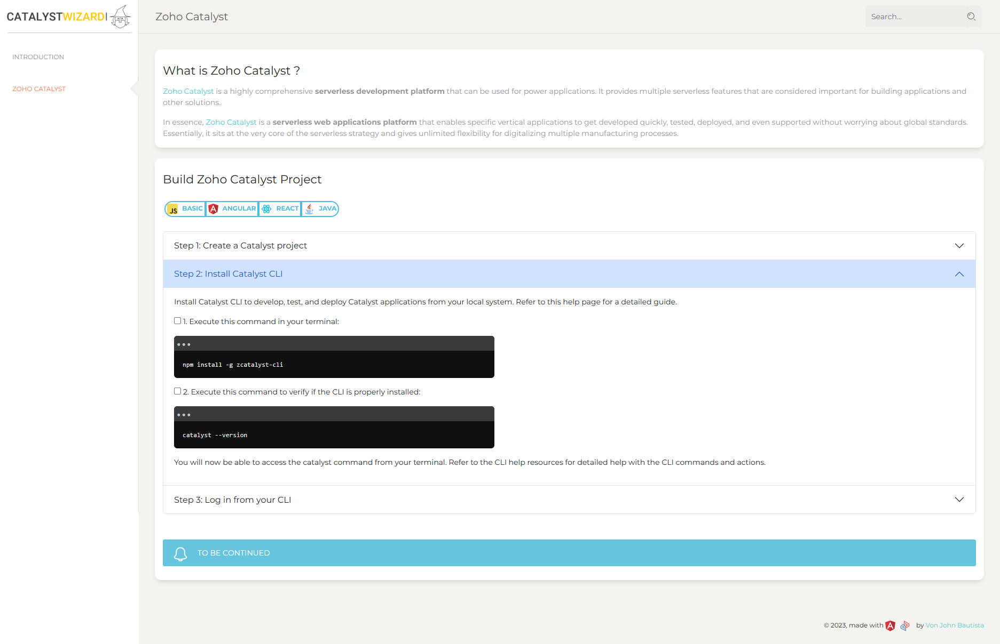
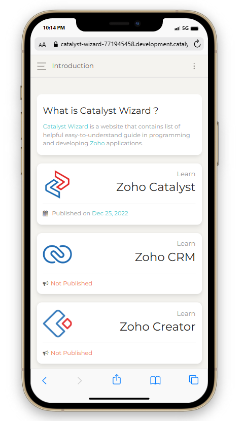
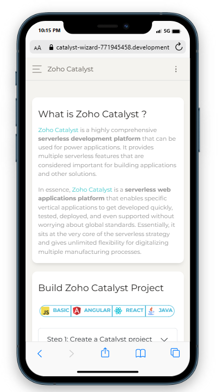

# zoho-catalyst-catalyst-wizard-angularJS

Catalyst Wizard is a website that contains list of helpful easy-to-understand guide in programming and developing Zoho applications.
[DEMO LINK](https://catalyst-wizard-771945458.development.catalystserverless.com/app/)
## Screenshot/s

## Feature/s

- Built with Angular JS
- Mobile friendly.

## Coming soon ..

- All components is on Zoho Catalyst Database
